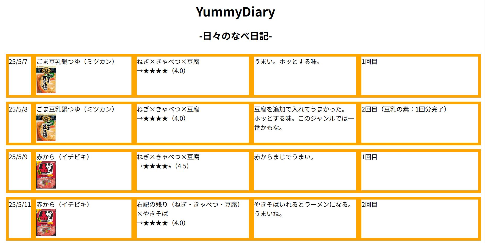

# Welcome to Cosmos Project "Yummy"

Yummy is a Cosmos Impact Web Service.

It aims to solve issues related to eating.  
First, I focus on solving problems related to NABE (Japanese hot pot).  
NABE is easy to cook and delicious, but we don’t always know what makes NABE truly "Yummy."  
This web service helps you understand that.

## What is NABE?
**NABE** is a Japanese-style hot pot dish where various ingredients like vegetables, meat, tofu, and noodles are cooked together in a shared pot.  
It is commonly enjoyed in winter and during gatherings.
> But I eat it in summer too. Why not? 😎🍲

Yummy helps you discover the most delicious NABE combinations.

🌐 Web Site（Web service）:English Language
https://yummyworldxxx.github.io/myweb/indexe.html 

🌐 Web Site（Web service）:Japanese Language
https://yummyworldxxx.github.io/myweb/

---

## 🔗 Source Code (GitHub)
👉 [Yummy GitHub Repository](https://github.com/yummyworldxxx/myweb)
Bug reports and improvement suggestions are welcome!
---

TERUO
