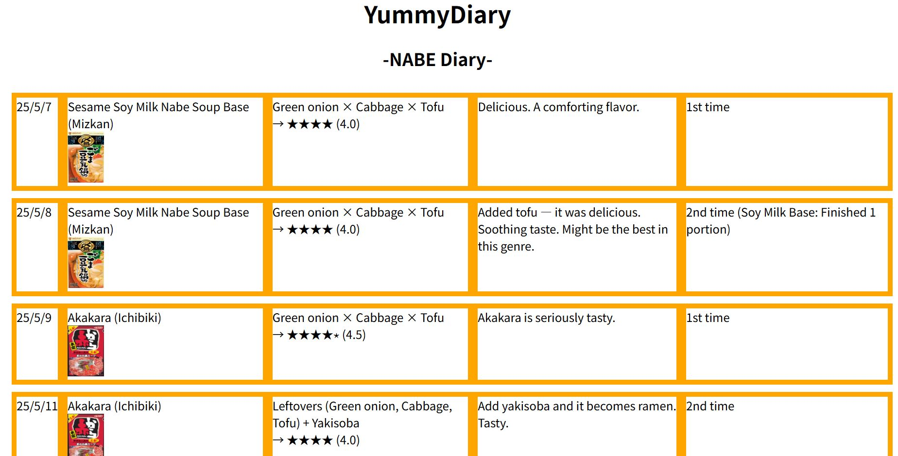

# 🚀 Welcome to Cosmos Project "Yummy" 🚀

**Yummy** is a Cosmos Impact Web Service.

It aims to solve issues related to eating.  
To start, I focus on solving problems related to **NABE** (Japanese hot pot).

NABE is easy to cook and delicious,  
but we don’t always know what makes NABE truly "Yummy."  
This web service helps you understand that.

---

## 🍲 What is NABE?

**NABE** is a Japanese-style hot pot dish where various ingredients—like vegetables, meat, tofu, and noodles—are cooked together in a shared pot.  
It’s commonly enjoyed in winter and during gatherings.

But I eat it in summer too. Why not? 😎🍲

---

## 🔍 What Yummy Can Do

**Yummy** helps you discover the most delicious NABE combinations  
and lets you rate and explore various NABE soup bases.

---

## 📸 Yummy Image（Yummy Image is one of the features of this web service.）

---

## 🌏 Multilingual Support

- English / Japanese

---

## 🌐 Web Service

- [English Version](https://yummyworldxxx.github.io/myweb/indexe.html)  
- [Japanese Version](https://yummyworldxxx.github.io/myweb/)

---

## 🔗 Source Code on GitHub

👉 [Yummy GitHub Repository](https://github.com/yummyworldxxx/myweb)  
Bug reports and improvement suggestions are welcome!

---

  — TERUO

